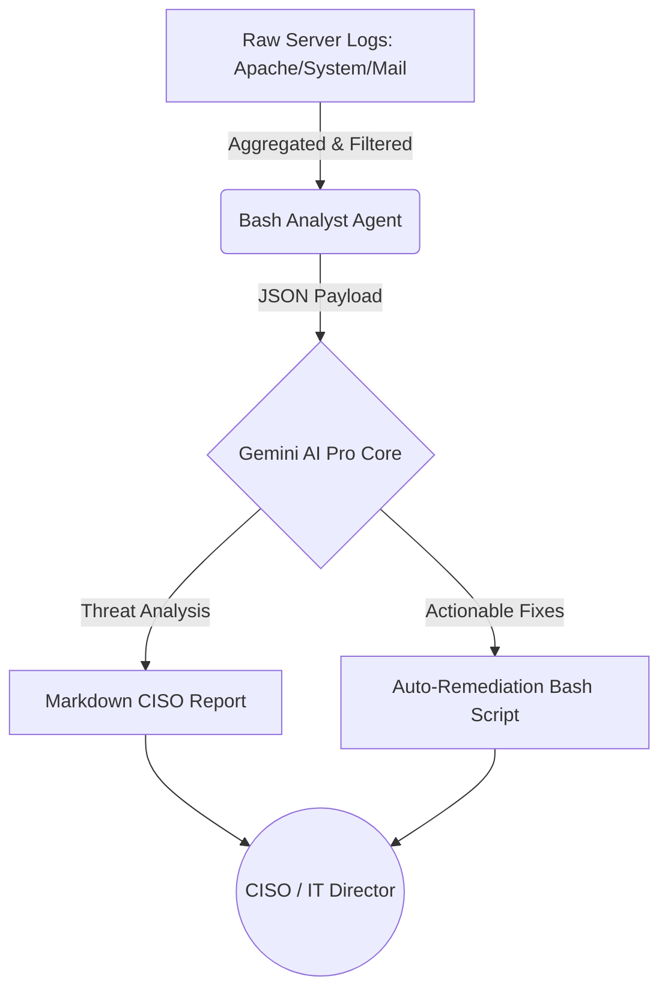

<div align="center">
  
  <h1>🛡️ Autonomous AI Cybersecurity Log Analyst</h1>
  <p><b>An AI-Driven Security Operations Center (SOC) for Enterprise Linux Servers. Powered by Google Gemini.</b></p>
  <p>
    <a href="https://powerhouseconsulting.group/infrastructure-security"><b>Learn about our Enterprise WAF & Server Hardening Deployments 🚀</b></a>
  </p>
</div>

---

## 🛑 The Vulnerability (The Pain)
Marketing agencies build interfaces; they do not secure servers. Unpatched CMS platforms, open ports, fragile shared-hosting setups, and zero bot-filtering lead to data breaches, resource exhaustion, and catastrophic crashes during traffic spikes.

This script acts as your first line of defense, proactively analyzing chaotic server logs to identify backdoors, malicious scrapers, and automated threat vectors before they compromise your data sovereignty.

## 🏰 The Fortress Architecture (The Solution)
The **AI Cybersecurity Log Analyst** uses Gemini Pro to digest thousands of lines of chaotic Apache, Nginx, Mail, and System logs, distilling them into a high-signal intelligence report for your CISO or Director of IT Operations. 

It then generates **executable, precise firewall (CSF) and remediation scripts** to neutralize the threats instantly.



## ✨ Core Capabilities
- **Top 3 Critical Priorities:** Isolates active intrusions, root compromises, and critical service failures from routine noise.
- **Actionable Remediation:** Auto-generates `csf` block commands and file permission fixes.
- **Deep-Code Diagnostics:** Identifies sloppy database queries and unpatched vulnerabilities surfacing in your logs.
- **High-Availability Focus:** Helps guarantee 99.99% uptime by catching resource-draining attacks early.

---

## 🚀 Installation & Configuration (For DevOps Professionals)

*Note: This script requires advanced knowledge of Linux environments, Google Cloud IAM roles, and firewall configurations.*

### 1. Prerequisites
- Root access to a Linux Server (AlmaLinux/CentOS/Ubuntu)
- `gcloud` CLI installed and authenticated with an active project.
- `jq` and `curl` installed.
- Custom log paths mapped to your specific infrastructure.

### 2. Deployment Steps
```bash
# 1. Clone the repository
git clone https://github.com/your-org/ai-cybersecurity-log-analyzer.git /opt/ai-soc

# 2. Configure Environment Variables
# You MUST edit the script to match your log paths and Gemini project IDs.
nano /opt/ai-soc/cybersecurity_analyst.sh

# 3. Setup Google Cloud IAM (Crucial)
# Ensure the server's service account has 'Vertex AI User' permissions.
gcloud auth login --cred-file=/path/to/your/secure-sa-key.json

# 4. Schedule the Cron Job
# Example: Run every Monday at 3 AM
0 3 * * 1 /opt/ai-soc/cybersecurity_analyst.sh > /dev/null 2>&1
```

---

<br>

> ## 🏢 Enterprise Deployments & Managed Security
> Setting up IAM roles, tuning noise filters, configuring firewall logic, and integrating this agent into custom, High-Availability VPS architectures requires absolute precision. 
> 
> **Are your servers currently passing rigorous penetration tests?** Don't risk locking out legitimate traffic or leaving backdoors unpatched.
> 
> Let **PowerHouse Consulting** deploy this architecture for you. We provide uncompromising infrastructure security, active bot-mitigation suites, and deep-code security audits backed by a 99.99% uptime guarantee.
> 
> 👉 **[Schedule a Deep-Code Diagnostic & Custom Deployment](https://powerhouseconsulting.group/infrastructure-security)**

---

## License & Ownership

**IP License holder and point of contact:**

**PowerHouse Consulting Group Pte Ltd**  
160 Robinson Road  
SBF Center Unit #24-09,  
068914, Singapore  
ACRA UEN 202108925N  

📧 **Contact:** support (at) powerhouseconsulting.group