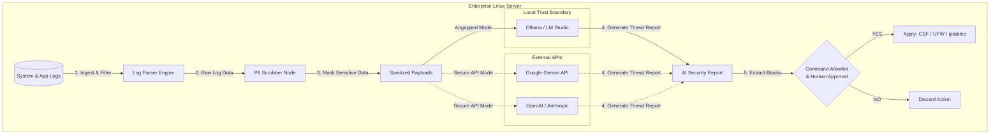

<div align="center">
  
  <h1>🛡️ CyberSecurity Analyst Agent</h1>
  <p><b>Free Autonomous SOC for Linux Servers. AI-powered log analysis with zero data egress.</b></p>
  <p>
    <a href="https://powerhouseconsulting.group/cybersecurity-analyst/"><b>🌐 Project Homepage</b></a> &nbsp;|&nbsp;
    <a href="https://powerhouseconsulting.group/cybersecurity-analyst/#pricing"><b>💎 Upgrade to PRO</b></a>
  </p>
</div>

---

## What It Does

The CyberSecurity Analyst Agent parses your Apache, Nginx, auth, database, and system logs using AI — and generates executable firewall remediation scripts. Free forever. Zero data leaves your server.

- **Multi-LLM:** Gemini, OpenAI, Claude, xAI, or local Ollama/LM Studio
- **Zero Data Egress:** Built-in PII scrubber redacts IPs and emails before API transmission
- **Firewall Ready:** Generates CSF, UFW, and iptables block lists
- **No registration:** No credit card, no email, no account

---

## 🚀 Quick Install

```bash
curl -fsSL https://powerhouseconsulting.group/cybersecurity-analyst-agent/install.sh | sudo bash
```

Installs in under 30 seconds. Creates `/opt/ai-soc/` and registers the `csa` command system-wide.

---

## 🖥️ TUI Interface

```
===========================================================================
   ______      __                 _____                      _ __
  / ____/_  __/ /_  ___  _____   / ___/___  ________  ______(_) /___  __
 / /   / / / / __ \/ _ \/ ___/   \__ \/ _ \/ ___/ / / / ___/ / __/ / / /
/ /___/ /_/ / /_/ /  __/ /      ___/ /  __/ /__/ /_/ / /  / / /_/ /_/ /
\____/\__, /_.___/\___/_/      /____/\___/\___/\__,_/_/  /_/\__/\__, /
     /____/                                                    /____/
===========================================================================
        AI Cybersecurity Log Analyst - Community Edition v1.2.1

[ SYSTEM MAIN MENU ]
> 1) Start Live Log Scan
   Time ranges: 24h | 3d | 7d | 14d | Current month
> 2) Proactive Hardening Audit
> 3) 🔥 Upgrade to PRO Version (Activate License Key)
> 4) Quit Application
-------------------------------------------------
```

---

## ⚙️ First-Run Setup

On first run, if no `.env` file exists, the script auto-creates one from the template and shows:

```
━━━━━━━━━━━━━━━━━━━━━━━━━━━━━━━━━━━━━━━━━━━━━━━━━━━━━━━━━━━━━━━━━━━━━━━━━━━━
  ⚙️  FIRST-TIME SETUP — Configuration Required
━━━━━━━━━━━━━━━━━━━━━━━━━━━━━━━━━━━━━━━━━━━━━━━━━━━━━━━━━━━━━━━━━━━━━━━━━━━━

[INFO] Creating default .env from template...

You MUST configure the following before running scans:
  1. CONFIGURED=true   — Set this to true at the top of the file
  2. YOUR_EMAIL        — Where reports are sent
  3. LLM_PROVIDER      — AI provider (gemini, openai, claude, local)
  4. MODEL_ID          — AI model to use
  5. API Key           — Your provider's API key
  6. Log Paths         — Paths to your server logs

Edit:  nano /opt/ai-soc/.env
Re-run:  csa
```

A persistent warning banner stays visible above the menu until `CONFIGURED=true` is set. The hardening audit, upgrade, and quit options remain functional without configuration.

---

## 📋 Key Architecture & Security Specifications

Evaluating on-premise security and data privacy is paramount for modern infrastructure architects. Below are the definitive technical and architectural details of the CyberSecurity Analyst core engine.

### 🧩 Supported AI LLM Engines
The agent features a provider-agnostic core that interfaces seamlessly with both cloud-hosted and completely local, airgapped models:
- **Google Gemini (Default API Engine):** Built-in native support for advanced Gemini models (including `gemini-1.5-flash`, `gemini-1.5-pro`, and `gemini-2.0` releases) using **Developer Gemini API Keys** (Google AI Studio). It bypasses all complex GCP OAuth and gcloud cli dependencies so you can deploy instantly.
- **Enterprise Public Providers:** Simple bindings to tap into other public intelligence models:
  - **OpenAI:** `gpt-4o`, `gpt-4o-mini`, and GPT-4 legacy pipelines.
  - **Anthropic Claude:** `claude-3-5-sonnet`, `claude-3-haiku` models.
  - **xAI (Grok):** `grok-beta` and `grok-2` API endpoints.
- **Local & Airgapped Private LLMs:** Full support for locally running model engines via **Ollama** or **LM Studio** (e.g., `llama3.1`, `qwen2.5-coder`, `mistral`, or domain-specific fine-tuned models) using a local standard HTTP API endpoint (`http://localhost:11434` or similar).

### 📊 Linux Log Parser Specs
The parsing engine leverages highly optimized, low-overhead bash utilities to filter and read log streams without impacting disk I/O. It dynamically adjusts ingestion bounds to fit your chosen menu time-range using native `-mtime`, `journalctl --since`, and dynamic cross-month regex patterns:
- **Web Applications (Apache & Nginx):** Monitored via configured `$APACHE_LOG_DIR` and `$NGINX_LOG_DIR` variables. Scans error logs for SQL Injection (SQLi), Cross-Site Scripting (XSS), Path Traversal, and Automated Vulnerability Scanners.
- **SSH & Server Authentication:** Monitored via `$SYSTEM_LOG_PATH` (e.g., `/var/log/secure`, `/var/log/auth.log`, or `/var/log/messages`). Tracks SSH brute-force attempts, unauthorized `sudo` elevation failures, and persistent authentication failures.
- **Systemd Journalctl:** Directly executes `journalctl -p 0..3` with temporal filtering constraints, analyzing severe system and kernel-level log alerts (emergency, alert, critical, and error messages).
- **Database Logs (MariaDB & MySQL):** Configured via `$MYSQL_SLOW_LOG_PATH`. Tracks slow queries, unindexed heavy SELECT statements, and potential blind SQL injection behaviors.
- **Mail Transports:** Monitored via `$MAIL_LOG_PATH` (e.g., `/var/log/maillog` or `/var/log/mail.log`). Catches outgoing spam waves, SMTP authentication brute force, and postfix configuration errors.

### 🛡️ Auto WAF & Firewall Rules
To support automated active defense, the agent parses security threats and synthesizes them into actionable mitigation rule scripts:
- **Multi-Firewall Adaptation:** Automatically detects active host-level firewalls and outputs compliant syntax commands for:
  - **CSF (ConfigServer Security & Firewall):** `csf -d <IP> <Reason>` (Active drop + syslog comment)
  - **UFW (Uncomplicated Firewall):** `ufw deny from <IP>`
  - **iptables:** `iptables -A INPUT -s <IP> -j DROP`
- **Active Defense Safety Whitelist:** To prevent accidental administrator lockouts or service self-blocks, the remediation compiler incorporates a strict multi-layer filter that refuses to generate block rules for:
  - Local loopback adapters (`127.0.0.1`, `::1`).
  - RFC 1918 private subnets and host-local interfaces.
  - Whitelisted office/developer IPs configured under the `WHITELIST_IPS` environment setting.
  - **Cloudflare CDN IP ranges:** Prevents blocking Cloudflare's proxy servers (which would inadvertently drop thousands of legitimate visitors).
- **Strict Command Allowlist Parser:** To neutralize prompt injection hazards, the agent parses and validates all generated remediation proposals before writing the script. Only explicit, whitelisted commands (e.g., `csf`, `ufw`, `iptables`, `chmod`, `chown`) are allowed in the output block.

### 🔒 Zero Egress & PII Masking
Data sovereignty is guaranteed through a rigorous on-server data sanitation pipeline. Security architects can inspect the raw data flow in the following privacy block diagram:


```mermaid
flowchart TD
    subgraph Server [Enterprise Linux Server]
        Logs[(System & App Logs)] -->|1. Ingest & Filter| Parser[Log Parser Engine]
        Parser -->|2. Raw Log Data| PII[PII Scrubber Node]
        PII -->|3. Mask Sensitive Data| Redacted[Sanitized Payloads]
        
        subgraph Local [Local Trust Boundary]
            Ollama[Ollama / LM Studio]
        end
        
        subgraph Cloud [External APIs]
            Gemini[Google Gemini API]
            OpenAI[OpenAI / Anthropic]
        end

        Redacted -->|Airgapped Mode| Ollama
        Redacted -.->|Secure API Mode| Gemini
        Redacted -.->|Secure API Mode| OpenAI
        
        Ollama -->|4. Generate Threat Report| Suggestion[AI Security Report]
        Gemini -.->|4. Generate Threat Report| Suggestion
        OpenAI -.->|4. Generate Threat Report| Suggestion
        
        Suggestion -->|5. Extract Blocks| Approved{Command Allowlist
& Human Approval}
        Approved -->|YES| Firewall[Apply: CSF / UFW / iptables]
        Approved -->|NO| Discard[Discard Action]
    end
```

- **Local Regex-Based PII Scrubber:** Prior to transmitting logs over any external API network boundary, the script scrubs raw payloads and replaces sensitive details locally on-the-fly:
  - IPv4 addresses are masked as `[REDACTED_IP]`
  - IPv6 addresses are masked as `[REDACTED_IPV6]`
  - Email addresses are masked as `[REDACTED_EMAIL]`
  - Standard user credentials and keys are dynamically redacted
- **Total Airgapped Security:** Running the agent with local model engines (Ollama/LM Studio) creates a completely closed loop. Zero bits of operational data or log telemetry leave the physical network interface of your server.

---

## 📋 Features

### Log Scan (with time-range selection)
```
[ SELECT TIME RANGE ]
> 1) Last 24 hours
> 2) Last 3 days
> 3) Last 7 days
> 4) Last 14 days
> 5) Current month
> 6) Cancel
```

All log sources adapt: `-mtime`, `journalctl --since`, and `DATE_PATTERN` use the selected range. Cross-month ranges are handled automatically.

### Proactive Hardening Audit
Checks SSH config, firewall status, fail2ban, unattended security updates, and open ports with ✓/✗ reporting and issue count.

### Configuration Sentinel
A `CONFIGURED=true` flag in `.env` prevents the app from silently running with default placeholder values. The warning is visible but non-blocking for non-scan operations.

### License Validation
PRO upgrade validation has a 10-second connect timeout + 15-second max duration. Invalid or unreachable servers return a clear error instead of hanging.

---

## 🔒 Supported Log Sources

| Source | Path / Method |
|---|---|
| Apache error logs | `$APACHE_LOG_DIR` (configurable) |
| Nginx error logs | `$NGINX_LOG_DIR` (configurable) |
| System/Firewall logs | `$SYSTEM_LOG_PATH` (e.g., `/var/log/syslog`) |
| Journalctl (systemd) | `journalctl -p 0..3 --since` |
| Mail logs | `$MAIL_LOG_PATH` (e.g., `/var/log/mail.log`) |
| MySQL slow queries | `$MYSQL_SLOW_LOG_PATH` |

---

## 💎 PRO Version

| Feature | Community | PRO |
|---|---|---|
| Core language | Bash | Go-native binary |
| Multi-LLM API | ✓ | ✓ |
| TUI dashboard | ✓ | ✓ (Interactive Dashboard) |
| Real-time watcher daemon | Cron interval | Real-time |
| Fleet clustering | — | ✓ (Master/Node) |
| 1-click firewall blocking | — | ✓ (CSF/UFW) |
| Slack/Telegram alerts | — | ✓ |
| MITRE ATT&CK mapping | — | ✓ |
| OSINT enrichment (Shodan/AbuseIPDB) | — | ✓ |

**Pricing:** From $497/yr (single node) to $1,497/yr (fleet up to 5 nodes). 14-day free trial.

👉 **[View Pricing & Upgrade](https://powerhouseconsulting.group/cybersecurity-analyst/#pricing)**

---

## 📝 Changelog

### v1.2.1 (2026-07-27)
- Synced Community Edition code, menu versions, and constants to `v1.2.1`
- High-capacity log event buffering (5,000 capacity) to eliminate thread jams (PRO Track)
- Proper EOF line caching to prevent trailing log records from being ignored (PRO Track)
- Accelerated tail scanning wait intervals from `500ms` to `50ms` (PRO Track)
- Active block command exception capturing and status bar reporting (PRO Track)
- Fixed circular gauge division-by-zero bounds errors when alerts count is zero (PRO Track)

### v1.2.0 (2026-07-24)
- 5-Tab Navigation (Dashboard, Monitoring, Hardening, Remediation, Insights) (PRO Track)
- Circular threat severity gauges and real-time activity feed panel (PRO Track)
- Live query bar (`/`) filtering by severities, IPs, threat types, or free text (PRO Track)
- Interactive log detail modals (`Enter`) showing expert AI analysis & CTAs (PRO Track)
- Help overlay menu (`?`) detailing full keyboard controls (PRO Track)
- Corrected dynamic uptime displays using dynamic duration tracking (PRO Track)

### v1.1.7 (2026-07-09)
- Persistent config warning visible above menu (not a blocker)
- Options 2/3/4 functional without .env configuration
- Single-line rejection for scan attempts when unconfigured

### v1.1.6 (2026-07-09)
- Time-range hints visible inline on main menu
- PRO upsell message on exit

### v1.1.5 (2026-07-09)
- `CONFIGURED` sentinel in `.env.example` prevents default-value runs
- Time-range submenu: 24h, 3d, 7d, 14d, Current month
- Dynamic `DATE_PATTERN` computation for cross-month ranges

### v1.1.4 (2026-07-09)
- License validation timeout (10s connect + 15s max)
- Graceful error messages instead of hanging on invalid keys

### v1.1.3 (2026-07-09)
- Real hardening audit replaces fake placeholder
- SSH, firewall, fail2ban, unattended updates, open ports checks

### v1.1.2 (2026-07-09)
- `VERSION` constant and TUI header display

### v1.1.1 (2026-07-09)
- Purchase URLs fixed to `cybersecurity-analyst/#pricing`
- `install.sh` moved to dedicated directory
- First-run `.env` guided setup experience

### v1.1.0 (2026-06-17)
- `csa` global command wrapper
- Multi-LLM API bindings (Gemini, OpenAI, Claude, xAI, Ollama)

---

## ⚖️ Legal

**© 2026 PowerHouse Consulting Group Pte Ltd. All Rights Reserved.**

PowerHouse Consulting Group Pte Ltd  
160 Robinson Road, SBF Center Unit #24-09  
Singapore 068914 | ACRA UEN: 202108925N\n